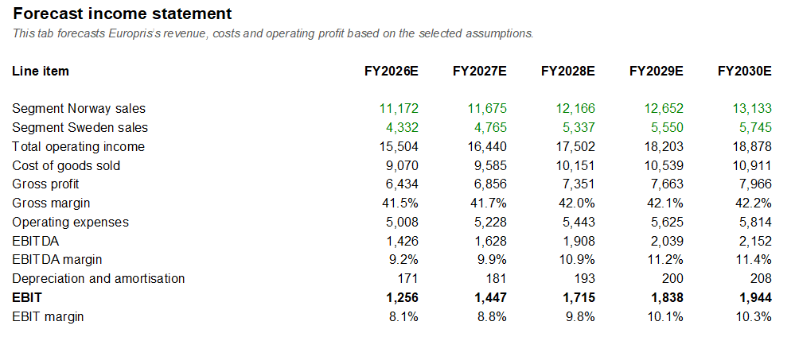
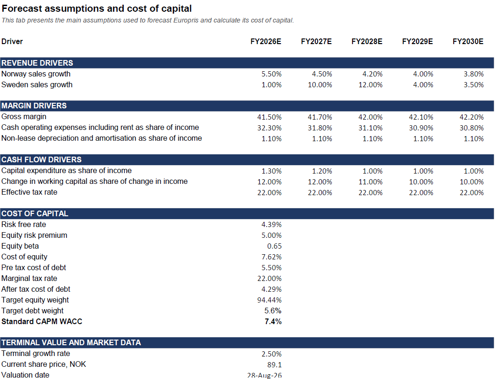
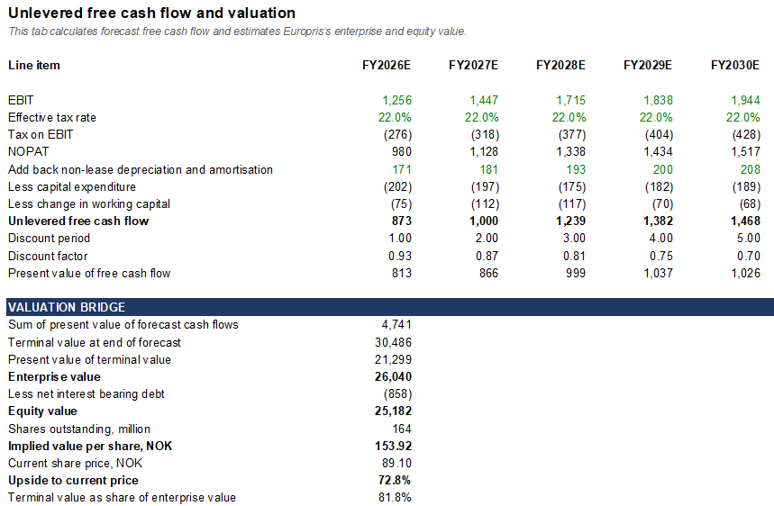
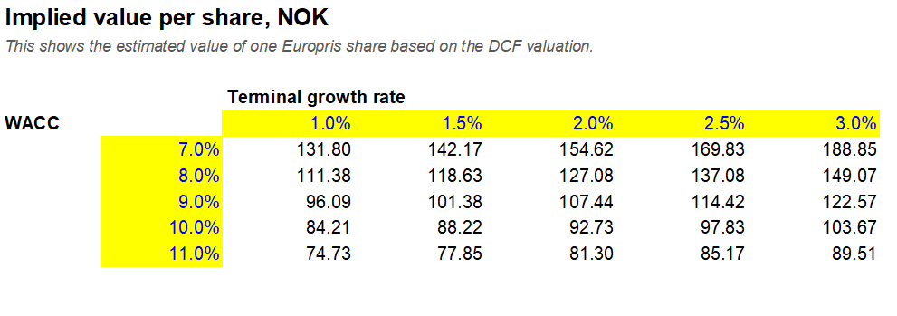
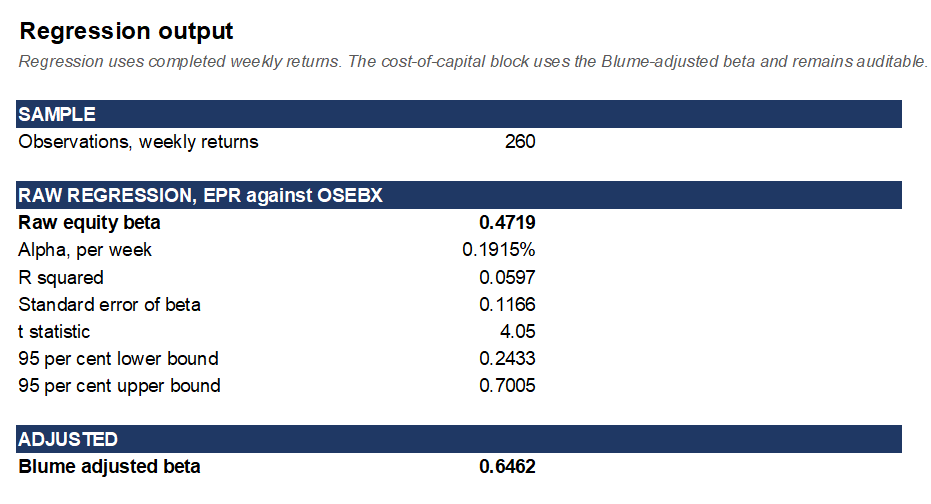

# Europris DCF Valuation

This project presents a five-year discounted cash flow valuation of Europris ASA, including financial forecasts, beta regression, WACC estimation and sensitivity analysis.

[Download the complete Excel model](Europris_DCF_Model.xlsx)

## Project contents

The Excel workbook includes:

- Historical financial analysis
- Five-year income statement forecast
- Unlevered free cash flow calculation
- Terminal-value calculation
- Equity-value bridge
- Beta regression against OSEBX
- WACC calculation
- Valuation sensitivity analysis

## Workbook preview

### Forecast income statement

### Assumptions and WACC

### DCF valuation

### Sensitivity analysis

### Beta regression

## Beta regression

The regression uses five years of weekly data for Europris and the Oslo Børs Benchmark Index.

- Raw regression beta: **0.4719**
- Blume-adjusted beta: **0.6462**
- R-squared: **5.97%**
- 95% confidence interval: **0.243–0.700**

The Blume-adjusted beta is used in the cost-of-equity calculation. The low R-squared indicates that Europris’s low beta primarily reflects its weak correlation with OSEBX rather than low total share-price risk.

## Assumptions – What the result says

The model uses a WACC of **7.44%**. This is the CAPM-based result before adding any size, liquidity or company-specific premium.

It is based on:

- Risk-free rate: **4.39%**
- Equity risk premium: **5.00%**
- Blume-adjusted beta: **0.6462**
- Cost of equity: **7.62%**
- After-tax cost of debt: **4.29%**
- Market-value equity weight: **94.4%**
- Market-value debt weight: **5.6%**

The equity weight is based on Europris’s market capitalisation. Debt is represented by net financial debt of NOK 858 million after lease liabilities are excluded.

Every input is documented and none was selected simply to produce a particular valuation result. Because the regression has a low R-squared, the 7.44% WACC should be interpreted as the lower end of a defensible range rather than as a precise estimate. The sensitivity analysis is therefore treated as a primary output of the model.

## DCF – What the result says

At a WACC of **7.44%** and terminal growth of **2.5%**, the model produces:

- Enterprise value: **NOK 26.0 billion**
- Implied value per share: **NOK 153.92**
- Market price: **NOK 89.10 on 28 August 2026**
- Terminal value as a share of enterprise value: **81.8%**

The terminal-value contribution exceeds the 75% threshold used as a model sanity check. The valuation is therefore highly dependent on the assumptions beyond the explicit forecast period.

The implied enterprise value is **18.3 times forecast FY2026 EBITDA**, while Europris trades at approximately **10.8 times** the same forecast EBITDA on a comparable pre-IFRS-16 basis. The DCF therefore implies a premium of approximately 69%. The terminal value also contains an implied exit multiple of **14.2 times FY2030 EBITDA**.

The difference between the model and the market is driven mainly by the discount rate rather than the explicit cash-flow forecast. The market price implies a required return of approximately **10.3%** using the same forecast cash flows.

The conclusion is therefore not that Europris is necessarily worth NOK 153.92 per share. Instead, the analysis suggests that the market applies a required return close to 10.5%, potentially reflecting scepticism about the Swedish turnaround.

The investment thesis depends on whether the Swedish store-remodelling programme can produce sufficient sales and margin improvements to reduce this perceived risk.

## Data sources

- Europris annual reports and financial statements
- Yahoo Finance: EPR.OL and OSEBX.OL
- Norwegian 10-year government bond yield
- Norwegian market risk premium research

## Disclaimer

This project was prepared for educational and portfolio purposes. It does not constitute investment advice.
